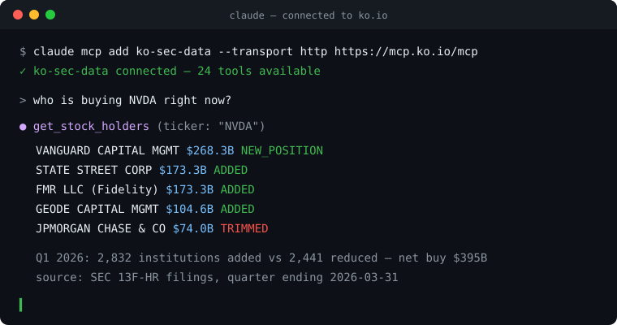

<div align="center">

# ko.io — Wall Street data feed for AI agents

**One command connects Claude, Cursor, Windsurf, Zed, Codex, and any MCP client
to 100M+ source-traced SEC records. Every answer traces to a real filing.**

[](https://github.com/SharpLu/ko-mcp/actions/workflows/ci.yml)
[](https://pypi.org/project/ko-edgar/)
[](https://www.npmjs.com/package/@ko-io/sdk)
[](LICENSE)

[Website](https://ko.io) · [Docs](https://ko.io/docs) · [MCP Setup](https://ko.io/mcp) · [Get a free key](https://ko.io/console) · [Pricing](https://ko.io/pricing)



</div>

## 30-second start

**In an AI agent (MCP)** — works instantly, no key needed:

```bash
claude mcp add ko-sec-data --transport http https://mcp.ko.io/mcp
```

Then ask: *"who is buying NVDA?"*, *"what did Congress trade last month?"*,
*"which institutions hold spot BTC ETFs?"* — the agent calls real tools and
cites real filings.

**Over REST** — keyless demo mode:

```bash
curl "https://api.ko.io/api/v1/institutions?search=berkshire&demo=true"
```

**In Python**:

```bash
pip install ko-edgar
```

```python
from ko_edgar import KoClient

ko = KoClient()  # demo mode; KoClient(api_key="ko_live_...") for your quota
for h in ko.stocks.holders("NVDA"):
    print(h["name"], h["holding_value"], h["action"])
```

**In TypeScript**:

```bash
npm install @ko-io/sdk
```

```ts
import { KoClient } from "@ko-io/sdk";

const ko = new KoClient(); // or { apiKey: "ko_live_..." }
const { rows } = await ko.congress.trades({ sort: "recent" });
```

Free keys are 200 calls/day, forever, no credit card → [ko.io/console](https://ko.io/console).

## What's in this repo

| Directory | What it is |
|-----------|------------|
| [`server/`](server) | **The hosted MCP server** (mcp.ko.io) — Cloudflare Worker, 24 tools, deployed from this repo |
| [`docs/clients/`](docs/clients) | Verified setup guides for every MCP client |
| [`python/`](python) | `ko-edgar` — official Python SDK (sync + async, typed) |
| [`typescript/sdk/`](typescript/sdk) | `@ko-io/sdk` — official TypeScript SDK (Node 18+, browsers, edge) |
| [`typescript/mcp-proxy/`](typescript/mcp-proxy) | `@ko-io/mcp-sec-data` — stdio bridge for clients without remote-HTTP MCP support |
| [`cookbook/`](cookbook) | 10 runnable answers to real investing questions |
| [`llms.txt`](llms.txt) | Machine-readable map of every tool and endpoint |

The MCP server in [`server/`](server) is the exact code running at
`https://mcp.ko.io/mcp` — every push deploys it. You can also self-host it on
your own Cloudflare account (`cd server && npx wrangler deploy`); it proxies
to `api.ko.io` with your API key, so your quota and plan follow you. The data
pipelines behind the API run as a managed service (dual-region, 3-replica
ClickHouse, 26 pipelines refreshing on each source's publication schedule).

> **Note**: `ko-edgar`, `@ko-io/sdk`, and `@ko-io/mcp-sec-data` publish to
> PyPI/npm at public launch. Until then, install from source
> (`pip install -e python/`). The hosted MCP endpoint and REST API work today.

## Connect your client

| Client | Guide | One-liner |
|--------|-------|-----------|
| Claude Code | [guide](docs/clients/claude-code.md) | `claude mcp add ko-sec-data --transport http https://mcp.ko.io/mcp` |
| Claude Desktop | [guide](docs/clients/claude-desktop.md) | remote HTTP config or `npx -y @ko-io/mcp-sec-data` |
| Cursor | [guide](docs/clients/cursor.md) | `~/.cursor/mcp.json` |
| Windsurf | [guide](docs/clients/windsurf.md) | Cascade → MCP |
| Zed | [guide](docs/clients/zed.md) | `context_servers` in settings |
| OpenAI Codex | [guide](docs/clients/codex.md) | `codex mcp add ko-sec-data --url https://mcp.ko.io/mcp` |
| ChatGPT / Gemini / Grok | [guide](docs/clients/chatgpt-gemini-grok.md) | REST API / Custom GPT Actions |

To use your own quota in any client, append `?api_key=YOUR_KEY` to the server
URL, or send `Authorization: Bearer YOUR_KEY`.

## The data

| Dataset | Coverage | Free tier |
|---------|----------|-----------|
| 13F institutional holdings | 85M+ rows, 2013 → today, family-consolidated | ✅ |
| Insider trades (Forms 3/4/5) | 11M+ transactions, open-market classified | ✅ |
| Congress trading | STOCK Act disclosures, both chambers | ✅ |
| Crypto ETF exposure | Institutional spot-BTC-ETF holdings from 13F | ✅ |
| Form 144 | Planned insider sales (forward-looking) | ✅ |
| Fails-to-deliver + Reg SHO | Short-side stress footprints | ✅ |
| Stock prices & financials | Daily OHLCV + XBRL-derived statements | ✅ |
| SEC filings gateway | Any filing document, signed shareable links | list/index ✅ · documents Pro |
| Macro (Treasury, Fed, CPI, OFR stress) | Daily federal sources | Pro |

All data is source-traced through the pipeline, and the filings gateway can
pull the underlying SEC documents — so your agent cites real filings instead
of inventing numbers.

## The 24 MCP tools

**Institutions**: `get_institution_holdings` · `list_institutions` ·
**Stocks**: `get_stock_profile` · `get_stock_holders` · `get_stock_activity` ·
`get_stock_price` · `get_stock_financials` ·
**Insiders**: `get_insider_trades` · `list_insider_traders` ·
**Congress**: `get_congress_trades` · `get_congress_member` ·
**Crypto**: `get_crypto_exposure` · `get_crypto_holders` · `get_crypto_holder` ·
**Filings**: `sec_list_filings` · `sec_get_filing_index` · `sec_get_filing_document` ·
**Short data**: `get_ftd_data` ·
**Search**: `search` · **Form 144**: `get_form144_notices` ·
**Macro (Pro)**: `get_treasury_yields` · `get_fed_rates` ·
`get_economic_indicators` · `get_financial_stress`

Full parameter reference: [llms.txt](llms.txt) · [ko.io/docs](https://ko.io/docs)

## Why not scrape EDGAR directly?

Excellent open-source tools exist for pulling raw filings from SEC EDGAR
(e.g. [sec-edgar-mcp](https://github.com/stefanoamorelli/sec-edgar-mcp) — if
you need one company's raw documents in a local process, it's a fine choice).
ko.io solves a different problem — the questions raw EDGAR can't answer:

| | Raw EDGAR access | ko.io |
|---|---|---|
| "Get AAPL's latest 10-K" | ✅ | ✅ (filings gateway) |
| "Who is buying NVDA across *all* institutions?" | ❌ needs every 13F parsed | ✅ 122ms |
| "Berkshire's portfolio, 52 quarters back" | ❌ parse 50+ filings live | ✅ precomputed |
| "Vanguard's 7 filing entities as one manager" | ❌ | ✅ family consolidation |
| Congress trades, FTD, macro, crypto exposure | ❌ not in EDGAR | ✅ |
| Works in web-based AI (claude.ai, ChatGPT) | ❌ local process | ✅ hosted MCP |
| Setup | Python env + install | one command, zero install |

## Plans

| | Demo (no key) | Free | Pro $29/mo | Team $99/mo |
|---|---|---|---|---|
| Calls/day | limited | 200 | 20,000 | 200,000 |
| Rows/request | 500 | 500 | 5,000 | 50,000 |
| Core SEC data | ✅ | ✅ | ✅ | ✅ |
| History depth | latest | latest | full | full |
| Macro (Treasury/Fed/CPI/stress) | — | — | ✅ | ✅ |
| Bulk export | — | — | — | ✅ |

Quota resets 00:00 UTC. MCP and REST share one quota. [Details →](https://ko.io/pricing)

## Contributing

Issues and PRs welcome — see [CONTRIBUTING.md](CONTRIBUTING.md).
Security reports: [SECURITY.md](SECURITY.md).

MIT © ko.io
